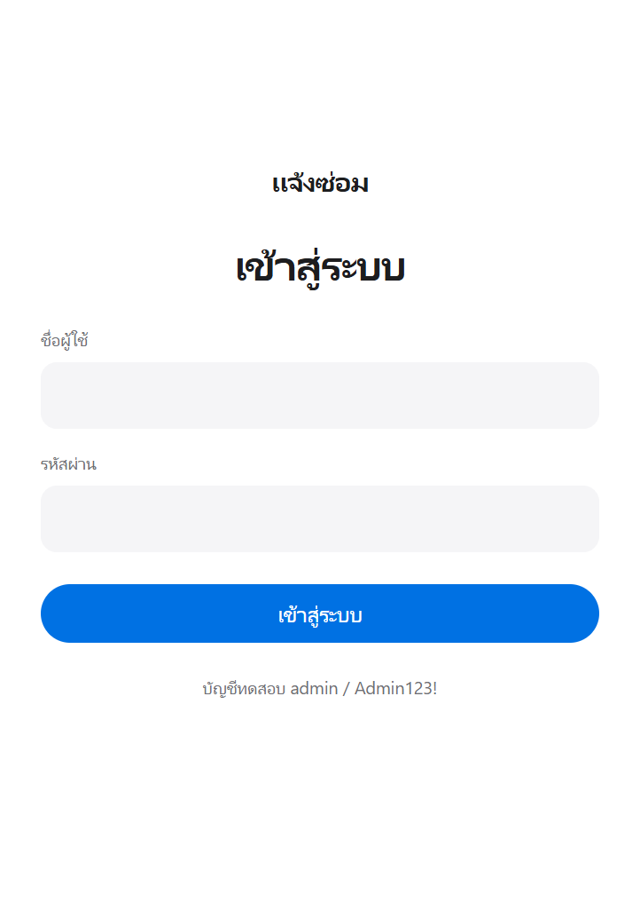
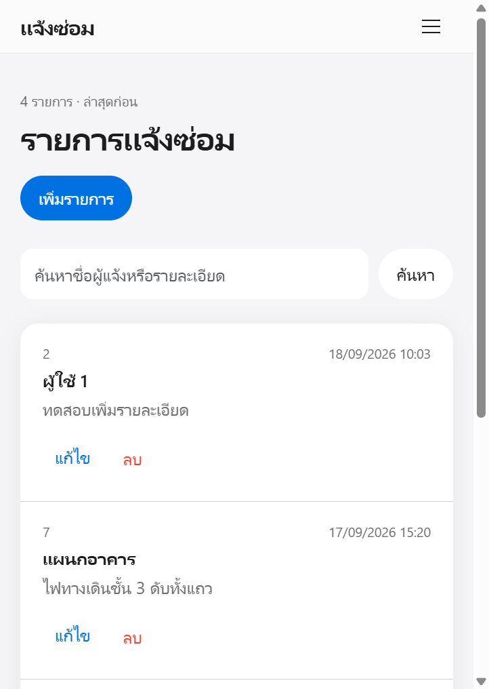
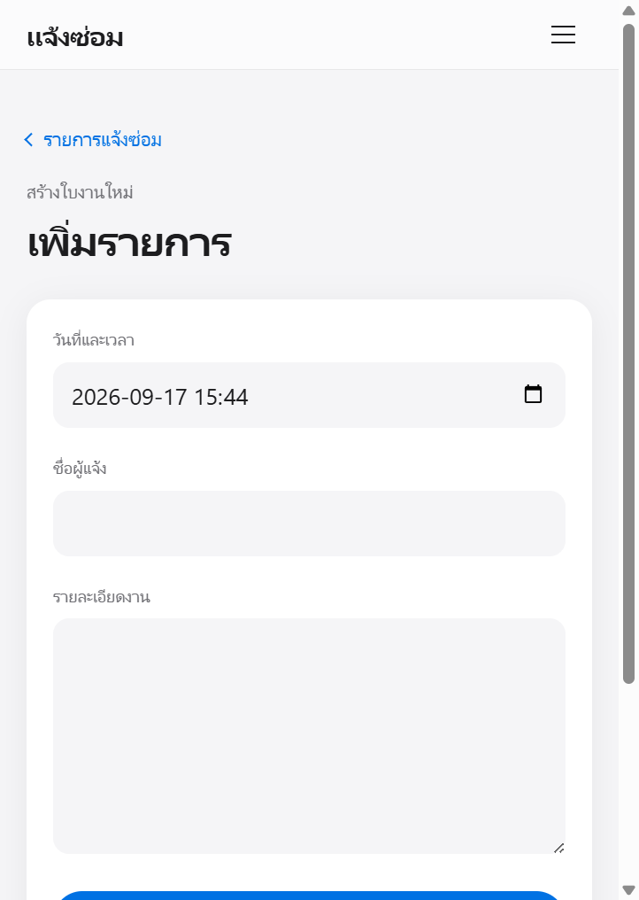
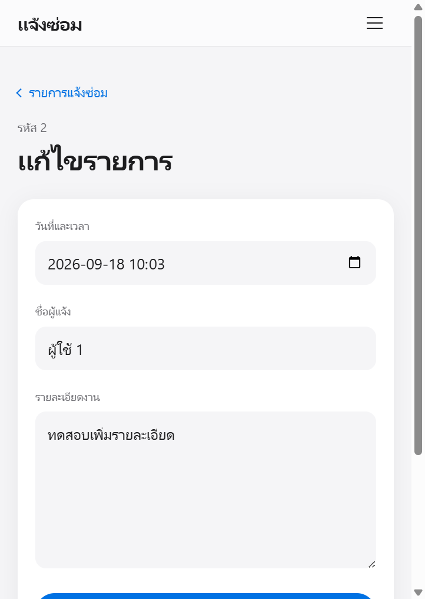

# ระบบแจ้งซ่อมทั่วไป

เว็บแอปพลิเคชันสำหรับบันทึก แสดง แก้ไข และลบใบแจ้งซ่อม  
เขียนด้วย PHP ธรรมดา เชื่อม MySQL ผ่าน PDO ไม่ใช้ Framework

เหมาะสำหรับทดลองใช้งานจริง หรือใช้เป็นตัวอย่างโปรเจกต์ CRUD ขนาดเล็ก

## ตัวอย่างหน้าจอ

<p align="center">
  
</p>

<p align="center"><em>หน้าเข้าสู่ระบบ</em></p>

<p align="center">
  
</p>

<p align="center"><em>หน้ารายการแจ้งซ่อม</em></p>

<p align="center">
  
</p>

<p align="center"><em>หน้าเพิ่มรายการ</em></p>

<p align="center">
  
</p>

<p align="center"><em>หน้าแก้ไขรายการ</em></p>

## ความสามารถ

- เข้าสู่ระบบก่อนใช้งานหน้าจัดการข้อมูล
- เพิ่มใบแจ้งซ่อม พร้อมวันที่ ชื่อผู้แจ้ง และรายละเอียดงาน
- แสดงรายการล่าสุดก่อน
- ค้นหาจากชื่อผู้แจ้งหรือรายละเอียด
- แก้ไขและลบรายการได้
- ตรวจข้อมูลฝั่งเซิร์ฟเวอร์ ถ้ากรอกไม่ครบจะไม่บันทึก
- รองรับภาษาไทยด้วย `utf8mb4`
- ใช้งานได้ทั้งคอมพิวเตอร์และมือถือ

## เทคโนโลยี

- PHP 8 ขึ้นไป
- MySQL หรือ MariaDB
- PDO Prepared Statements
- HTML5
- Bootstrap 5
- JavaScript เฉพาะส่วนที่จำเป็น

## โครงสร้างโปรเจกต์

```text
repair-system/
├── assets/
│   ├── css/app.css
│   └── js/app.js
├── config/database.php
├── includes/
│   ├── init.php
│   ├── header.php
│   └── footer.php
├── docs/
│   ├── login.png
│   ├── list.png
│   ├── create.png
│   └── edit.png
├── index.php
├── create.php
├── edit.php
├── delete.php
├── login.php
├── logout.php
├── database.sql
└── README.md
```

## สิ่งที่ต้องติดตั้ง

- PHP 8 ขึ้นไป พร้อมส่วนขยาย `pdo_mysql` และ `mbstring`
- MySQL หรือ MariaDB
- เว็บเซิร์ฟเวอร์ เช่น Apache จาก XAMPP หรือ Laragon

## ติดตั้งและใช้งาน

### 1. โหลดโปรเจกต์

วางโฟลเดอร์ `repair-system` ไว้ที่

- XAMPP: `C:\xampp\htdocs\repair-system`
- Laragon: `C:\laragon\www\repair-system`

### 2. สร้างฐานข้อมูล

เปิด phpMyAdmin หรือ MySQL client แล้วรันไฟล์ `database.sql`

สคริปต์นี้จะสร้าง

- ฐานข้อมูล `repair_system`
- ตาราง `repairs` และ `users`
- ผู้ใช้ฐานข้อมูล `repair_app`
- บัญชีเข้าสู่ระบบ `admin`

### 3. ตั้งค่าการเชื่อมต่อ

แก้ค่าใน `config/database.php` ให้ตรงกับเครื่องที่ใช้

```php
$dbHost = '127.0.0.1';
$dbPort = '3306';
$dbName = 'repair_system';
$dbUser = 'repair_app';
$dbPass = 'ChangeMe_RepairApp_123!';
```

ถ้า MySQL ของ XAMPP ไม่ได้ใช้พอร์ต `3306` ให้เปลี่ยน `$dbPort` ตามจริง  
อย่าใช้ `root` เป็นผู้ใช้ของแอปพลิเคชัน

### 4. เปิดระบบ

Start Apache และ MySQL แล้วเปิด

```text
http://localhost/repair-system/
```

## บัญชีทดสอบ

| ประเภท | ชื่อผู้ใช้ | รหัสผ่าน |
| --- | --- | --- |
| เข้าสู่ระบบเว็บ | `admin` | `Admin123!` |
| เชื่อมต่อฐานข้อมูล | `repair_app` | `ChangeMe_RepairApp_123!` |

ควรเปลี่ยนรหัสผ่านก่อนนำไปใช้จริง

## วิธีทดสอบคร่าวๆ

1. เปิดเว็บ ต้องเจอหน้าเข้าสู่ระบบ
2. ลองกดเข้าสู่ระบบโดยไม่กรอกข้อมูล ระบบต้องแจ้งเตือน
3. เข้าสู่ระบบด้วยบัญชีทดสอบ
4. เพิ่มรายการใหม่ แล้วกลับมาหน้ารายการ
5. ค้นหา แก้ไข และลบรายการ
6. ตอนลบต้องมีหน้าต่างยืนยัน
7. ออกจากระบบ แล้วเปิด `index.php` ตรงๆ ต้องถูกพากลับไปหน้า Login

## ความปลอดภัย

- เก็บรหัสผ่านด้วย `password_hash`
- ใช้ PDO Prepared Statements กัน SQL Injection
- Escape ข้อมูลก่อนแสดงผลด้วย `htmlspecialchars` กัน XSS
- ลบข้อมูลด้วย HTTP POST เท่านั้น
- ตรวจสอบว่า ID เป็นจำนวนเต็มก่อนค้นหา แก้ไข หรือลบ
- แอปเชื่อมต่อฐานข้อมูลด้วย user ที่ได้สิทธิ์เฉพาะ `repair_system`

## License

ใช้เพื่อการศึกษาและทดสอบได้ตามสะดวก
